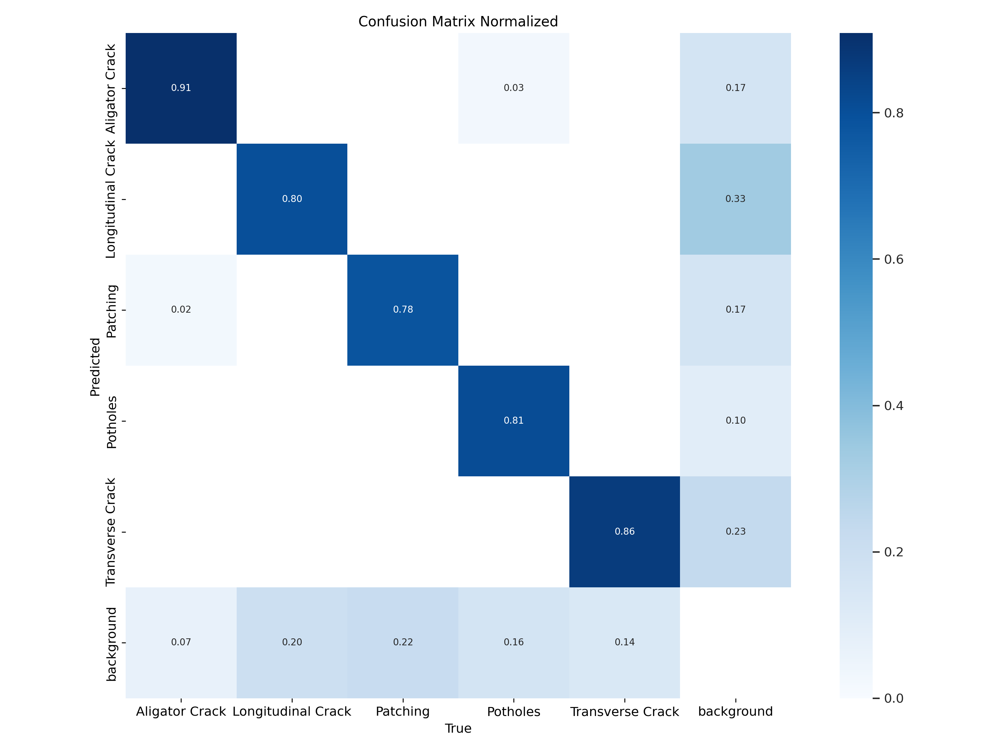

# YOLO+Transformer

This project combines the power of YOLO (You Only Look Once) for fast object detection with the C3TR (Context-aware Cross-scale Transformer for Object Tracking) architecture to enhance accuracy and context understanding on a custom dataset.

## colab code for train

## 📁 Structure
- `src/` contains training and evaluation code
- `model/` has the stracture model (.ymal file)
- `results/` includes evaluation results and plots

## 🧠 Model
The model is a yolo with C3TR trained on my dataset for joubar road damage detection.

## 🔧 Requirements
Install dependencies in Requirements.txt 

## link for our dataset
You can download the dataset from [Google Drive](https://drive.google.com/file/d/1G61lBk7_qMBkvVXO4S4wsAOa19HOr_QH/view?usp=sharing).

# Result

nlnlnl